# ECMAScript和JavaScript的关系

ES是JS的标准，JS是ES的实现

## 历史

JS最初由Netscape网景公司的布兰登·艾奇发明，用于解决当时网景公司的一款浏览器Navigator的用户交互问题。

后来网景公司想把JS标准化，就把JS交给了ECMA组织（欧洲计算机制造联合会），而且java是当时sun公司的商标，所以就使用了ECMAScript这个名字。

## ES版本的历史

+ 1998.06 - ES2发布
+ **1999.12 - ES3**发布，成为js的通行标准，被广大浏览器支持
+ 2007.10 - ES4草案发布，内容十分激进
+ 2008.07 - 将ES4小部分内容提取，发布为ES3.1，后命名为ES5
+ 2009.12 - ES5发布，也就是上面说的ES3.1
+ 2011.06 - ES5.1发布，并成为了ISO国际标准
+ 2013.03 - ES6草案冻结，不再加入新功能
+ **2015.06 - ES6正式通过**，成为国际标准

ES6又指下一代JS标准，从2015年开始用年份来标注ES6的版本号，所以ES2016、ES2017等都是属于ES6，每个新版本的内容都会依赖于之前的版本，所以这次笔记为ES2015。

# let与块级作用域

之前声明变量一般会使用 

1. ```javascript
   // var关键字
   var name;
   var age = 18;
   ```

2. ```javascript
   // 直接使用
   // 本质上是往window对象上挂了一个属性，也可以直接赋值一个函数让它变成window对象上的一个方法
   age = 18;
   console.log(window.age)  // 18
   // 这种方式会污染对全局对象，所以不建议这么用
   ```

let和var相似，也是对变量进行声明。

那区别呢？

### let和var的区别

let声明的变量只在当前（块级）作用域内有效。

var声明的变量只在当前作用域内有效。

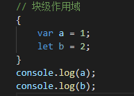

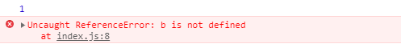

let声明的变量不能被重复声明。

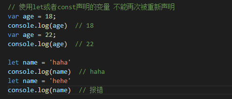

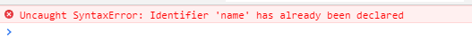

不存在变量提升。

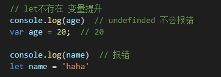

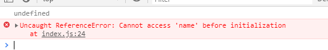

## ES6之前的作用域 

全局作用域

函数作用域

eval作用域

## 块级作用域

通俗的说 就是一对花括号中的区域 `{ ... }`

```javascript
// 比如
if () {}
switch () {}
for () {}
try {} catch (err) {}
{}
// 注意： 声明一个对象的时候，花括号就不再是块级作用域了
```

块级作用域可以嵌套

```javascript
{
    // 块级作用域1
    {
        // 块级作用域2
    }
}
```

## 暂存死区

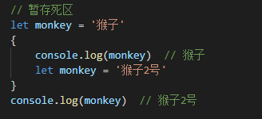

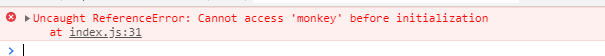

ES6规定，如果块级作用域中存在 `let` `const` 声明的变量，那么一开始就会形成一个封闭的作用域。

简单说，即使向上的作用域中存在同名变量也是拿不到的。

## let小例子

Q：生成10个按钮，每个按点击的时候弹出 1 - 10

### 使用var实现

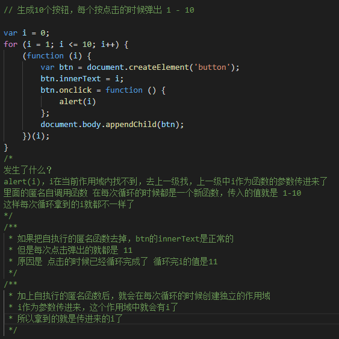

### 使用let实现

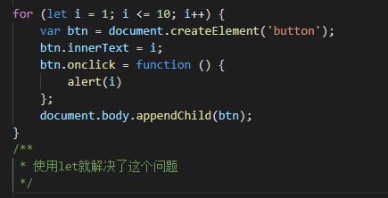

# const

用来声明常量 - 不可改变的量

和声明变量一样，基本只是关键字的区别

常量必须在声明的时候赋值，否则会报错

与let类似的特征

+ 不能重复声明
+ 不存在提升
+ 只在当前（块级）作用域内有效

常量不可被修改，但是当常量为引用类型的时候，不能保证不可变

因为const只能保证常量指向的地址不变

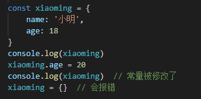

同为引用类型的数组和函数也是同样道理。

## 两个问题

### Q：怎么解决引用类型的常量可以被修改的问题

使用 `Object.freeeze()`

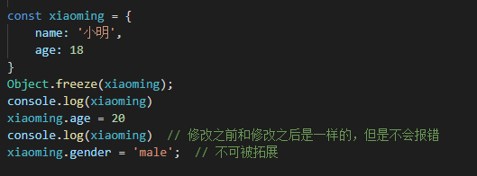

此函数对数组、函数同样有效。对数组使用的时候，如果修改数组会报错。

### Q：ES6之前怎么声明常量

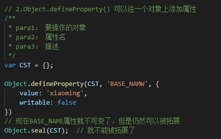

同时使用 `Object.defineProperty()` 和 `Object.seal()` 可以实现 `Object.freeze()`的效果

那么就来自己封装一个 `freeze`函数

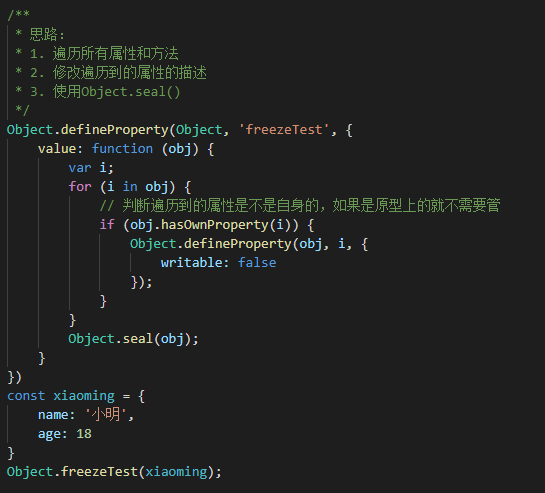

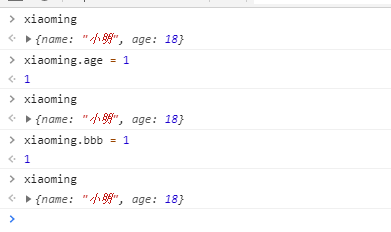

这样就做好了一个简单的封装，但是如果遇到属性还是Obj的情况就仍然无法保证，下面改进一下

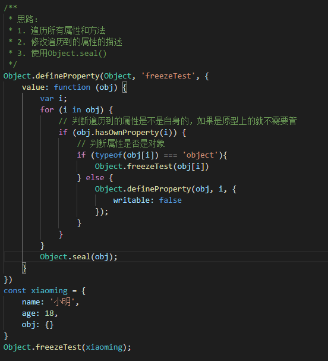
