# 解构赋值

解构赋值语法是一个JavaScript表达式，这使得可以将值从数组或属性从对象提取到不同的变量中。

## 数组的解构赋值

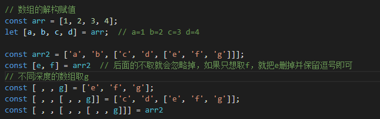

### 扩展运算符

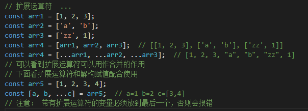

### 默认值

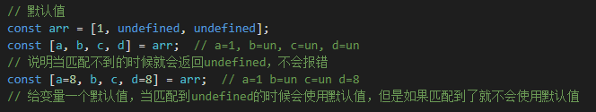

### 交换变量

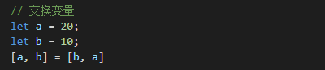

### 接收多个 函数返回值

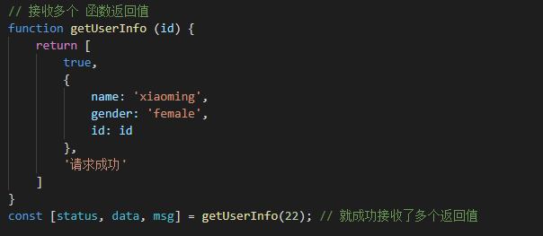

## 对象的解构赋值

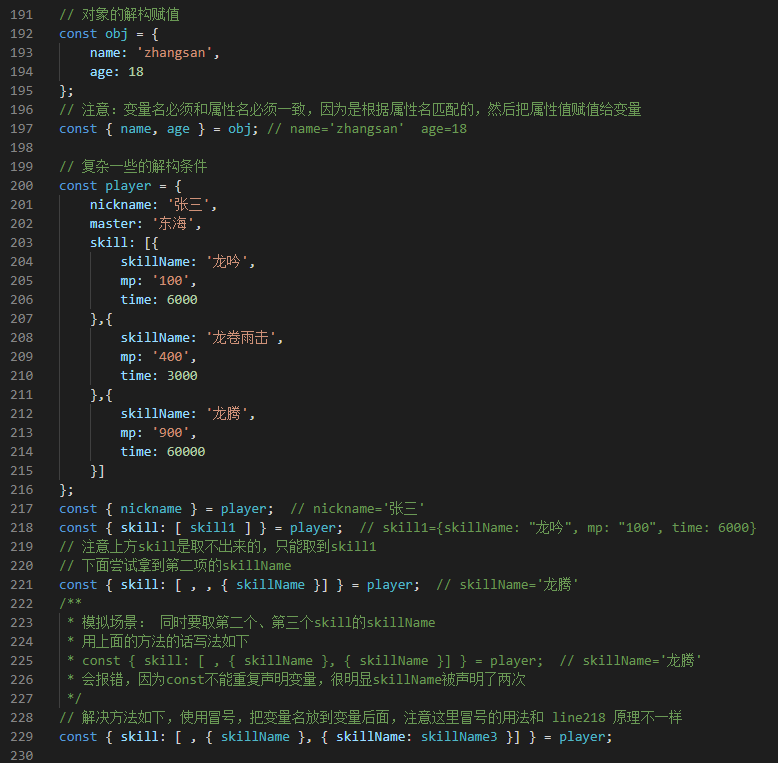

### 结合扩展运算符

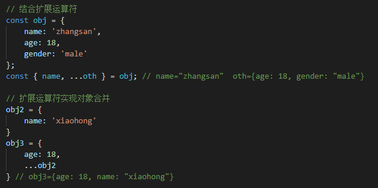

### 对已经申明了的变量进行对象的解构赋值

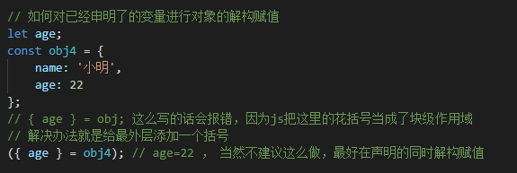

### 默认值

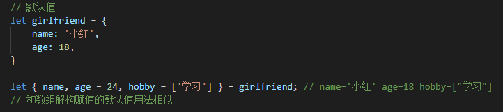

### 一些常用的用法

#### 使用对象传入乱序的函数参数

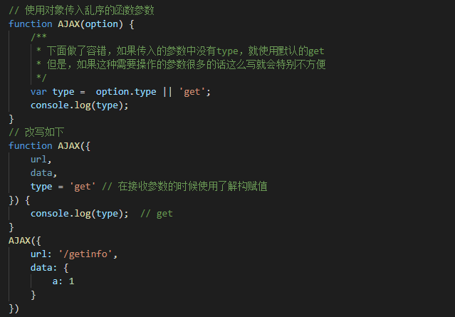

#### 获取多个 函数返回值

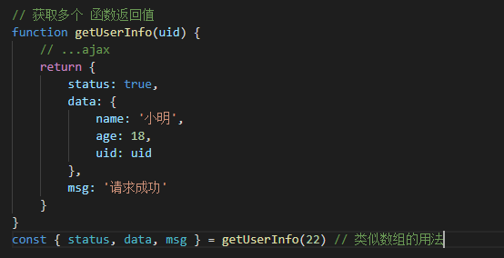

## 字符串的解构赋值

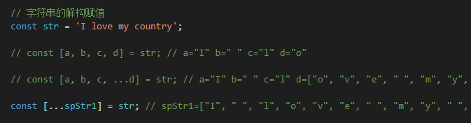

### 提取字符串的属性和方法

```javascript
// 提取字符串的属性或方法
const str = 'I love my country';
const { length, split } = str;  // length:17  split:ƒ split() { [native code] }
```

## 数值与布尔值的解构赋值

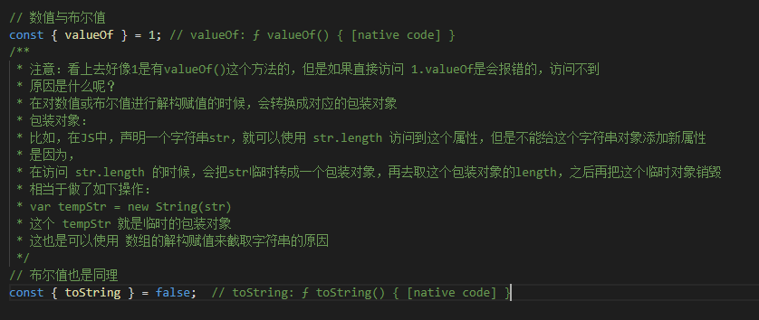

## 函数参数的解构赋值

见前面的例子，传入函数的参数、取多个 函数返回值。