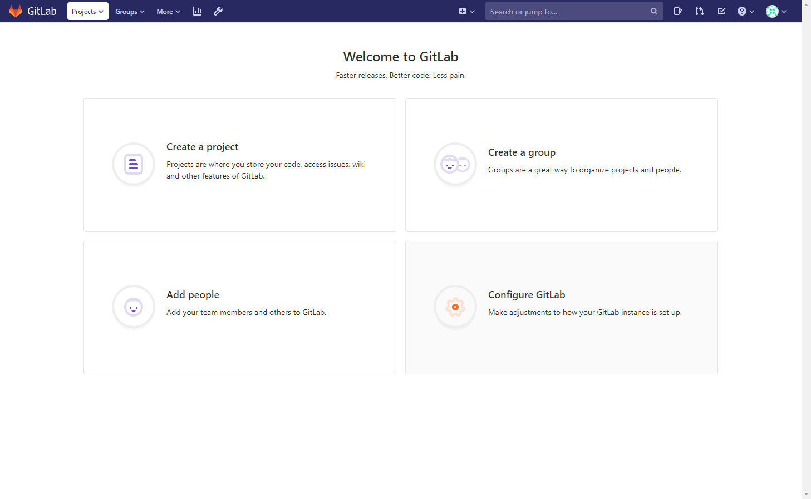
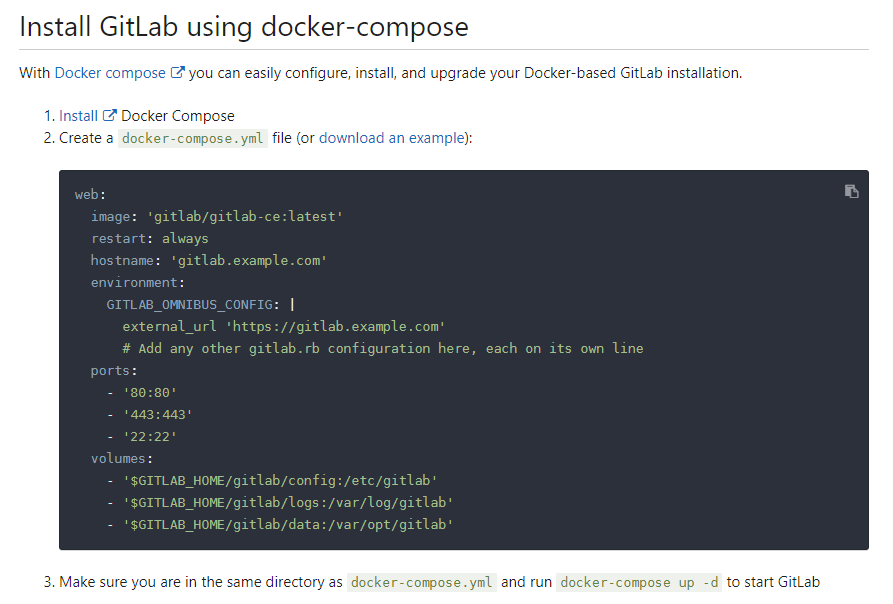
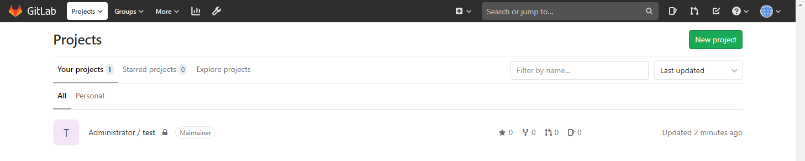
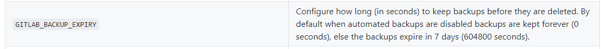
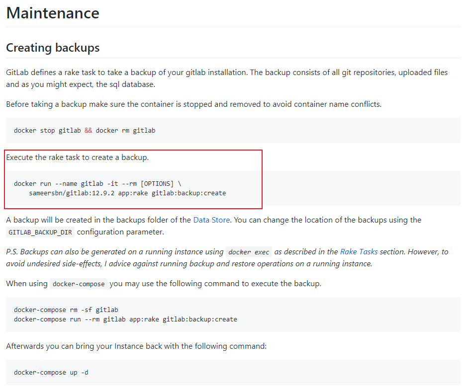
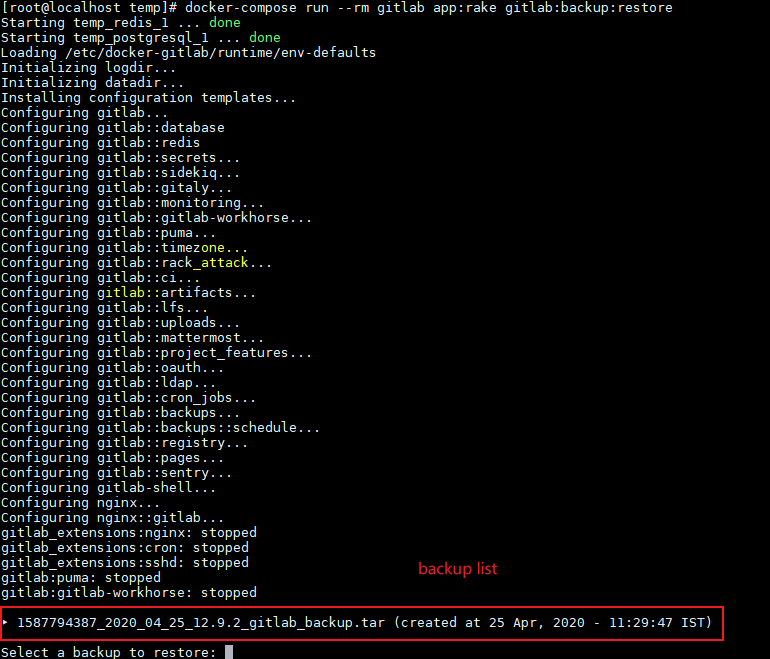
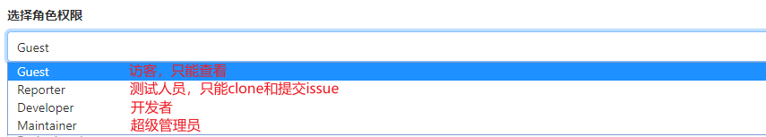
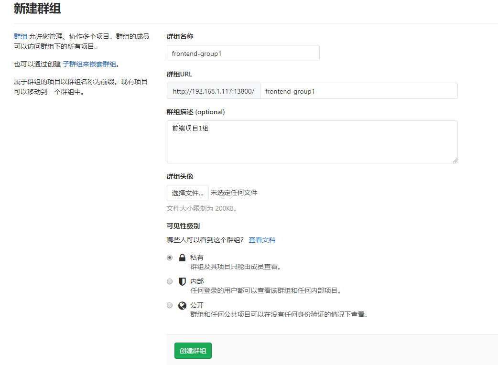

---

title: GitLab搭建(docker环境)

categories: 

- 技术杂谈

  - Git

tags: GitLab

date: 2020-3-1 12:00:00

updated:
---

# Gitlab优点

Gitlab也是一个git平台，管理仓库和项目

+ 现在很多Git平台对团队协作人数有限制
+ 可定制化对接自动化平台Jenkins
+ 可定制样式、哪些邮箱可以注册
+ 可设置每个用户可以上传的文件数的大小

# 安装GitLab

参考： [官方文档](https://about.gitlab.com/install/)，找到[以Docker方式安装](https://docs.gitlab.com/ee/install/docker.html)。

可以找到最简单的一种方法来快速进行GitLab平台的测试和运行。

```shell
sudo docker run --detach \
  --hostname gitlab.example.com \
  --publish 443:443 --publish 80:80 --publish 22:22 \
  --name gitlab \
  --restart always \
  --volume $GITLAB_HOME/gitlab/config:/etc/gitlab \
  --volume $GITLAB_HOME/gitlab/logs:/var/log/gitlab \
  --volume $GITLAB_HOME/gitlab/data:/var/opt/gitlab \
  gitlab/gitlab-ce:latest
```

> 附：各种参数的意义： 
>
> + --detach： 等同于 `-d` ，后台运行。
> + --hostname：指定域名，建议使用云服务器，域名指向IP，可以更方便的访问和迁移。也可以是虚拟机的IP。
> + --publish： 一些端口的映射，前面的数字是宿主机的端口。
> + --name gitlab：指定的镜像的名称。
> + --restart：当Docker服务重启的时候，GitLab服务自动重启。
> + --volume：Docker容器内的GitLab服务的数据映射到宿主机上。

下面就在虚拟机里修改一下命令：

```shell
# 这里只做测试运行，所以删除了一些参数
sudo docker run --detach \
  --hostname 192.168.1.117 \
  --publish 18800:80 --publish 12222:22 \
  --name gitlab \
  --restart always \
  gitlab/gitlab-ce:latest
```

> 附： 开放防火墙端口
>
> `firewall-cmd --add-port=18800/tcp --permanent`
>
> `firewall-cmd --reload`

等待一下，可以通过`docker logs -f xxxx` 来实时打印gitlab的日志查看

*注： 这种方法没有传入任何的username和pwd，默认用户名是root，在第一次访问的时候提示设置管理员密码。*

访问页面大概长这个样子。



但是使用 `docker run` 快速生成的gitlab服务远达不到生产的需求，比如没有HTTPS协议、SSH克隆项目的默认端口设置、邮件提示服务（merge request）、找回密码等等。

# 使用docker-compose 搭建

同样在官方文档中有[install GitLab using docker-compose](https://docs.gitlab.com/omnibus/docker/#install-gitlab-using-docker-compose)



我们选择更方便的方法

在github上有 [docker-gitlab](https://github.com/sameersbn/docker-gitlab) 项目，里面有很多功能比如升级、备份、恢复、邮箱等等功能都准备好了。

找到项目中的 [docker-compose.yml](https://github.com/sameersbn/docker-gitlab/blob/master/docker-compose.yml) 文件，文件很长，我们按需设置就行了。

```yaml
    - GITLAB_HOST=localhost  # IP地址
    - GITLAB_PORT=10080  # gitlab端口
    - GITLAB_SSH_PORT=10022 # SSH端口
    - GITLAB_RELATIVE_URL_ROOT=
    - GITLAB_SECRETS_DB_KEY_BASE=long-and-random-alphanumeric-string
    - GITLAB_SECRETS_SECRET_KEY_BASE=long-and-random-alphanumeric-string
    - GITLAB_SECRETS_OTP_KEY_BASE=long-and-random-alphanumeric-string
    
    - GITLAB_ROOT_PASSWORD= # gitlab 密码
    - GITLAB_ROOT_EMAIL= # 管理员邮箱
    
    - GITLAB_HTTPS=false
    - SSL_SELF_SIGNED=false # 是否使用自签名的方式，如果是自申请的证书，则需要在gitlab加载一下证书
```

配置好 `.yml` 文件后，就可以使用 `docker-compose up -d` ，创建运行了，创建的过程可能会持续数分钟，可以使用 `docker logs -f xxx` 来查看进度。

然后就可以访问服务并创建项目了。



# GitLab平台的备份&恢复

## 自动备份

使用上述方法创建的镜像已经帮我们设置好了一个定时任务，备份的周期是天。

可以在 `.yml` 文件内查看到。

```yaml
    - GITLAB_BACKUP_SCHEDULE=daily # 周期是天
    - GITLAB_BACKUP_TIME=01:00 # 在每一天01:00时备份
```

## 设置超期时间



默认数值是按秒计算的，如果想要每七天设置一下超时的话，就要设置为604800秒。

如果不设置，backup都会被保存下来。

重新编辑 `.yml`文件，在如下位置添加 `   - GITLAB_BACKUP_EXPIRY=604800` 


这样在第八天就会自动删除第一天的备份。

```shell
# 更新配置文件
docker-compose up -d
```

## 手动备份

在github文档中可以查到方法



### 使用docker-compose手动备份

使用 

```shell
docker-compose run --rm gitlab app:rake gitlab:backup:create
```

就备份好了。

## 恢复

```shell
docker-compose run --rm gitlab app:rake gitlab:backup:restore # List available backups
docker-compose run --rm gitlab app:rake gitlab:backup:restore BACKUP=1417624827 # Choose to restore from 1417624827
```

首先查看备份文件list



然后将想要恢复的文件名复制粘贴进去即可

`1587794387_2020_04_25_12.9.2_gitlab_backup.tar`

会提示： 一旦恢复所有数据库将被覆盖，是否继续，键入yes即可。

# GitLab的权限

团队协作中可能出现的问题：

如果把所有的分支全部开放，某人误推送到了主干分支（生产分支）上了，可能会导致一些不可预期的问题。那么就进行权限控制。

## 权限控制思路

+ 以组为单元，设置管理员。

  所有参与项目的人员为一个组，管理员负责项目分支的合并，管理员设置主干分支、哪些成员可以添加进来查看。

+ 熟悉Merge Request，写好git commit。

+ 及时回收权限，或者设置过期时间。

  注意，回收权限时不要删除成员，只把权限回收即可。因为如果删除成员的话就会把他的历史提交一并删除掉，无法溯源。

建议的角色分配



## 组管理&组权限

GitLab的组类似GitHub上组织的概念

比如来了一个 `frontend-group1` 项目组，



然后就可以设置组权限，注意这里设置的权限是针对所有项目的权限，和之前的项目权限做区分。

## 分支保护

在 项目 - 设置 - 仓库 - Protected Branches 中设置受保护的分支、允许推送和合并的Roles。

