# Docker


Docker 是一个开源的应用容器引擎，基于 [Go 语言](https://www.runoob.com/go/go-tutorial.html) 并遵从 Apache2.0 协议开源。

Docker 可以让开发者打包他们的应用以及依赖包到一个轻量级、可移植的容器中，然后发布到任何流行的 Linux 机器上，也可以实现虚拟化。

容器是完全使用沙箱机制，相互之间不会有任何接口（类似 iPhone 的 app）,更重要的是容器性能开销极低。

Docker 从 17.03 版本之后分为 CE（Community Edition: 社区版） 和 EE（Enterprise Edition: 企业版），我们用社区版就可以了。

docker技术主要应用在**容器化应用**上。

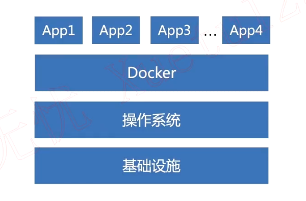

# docker虚拟技术和传统虚拟机区别

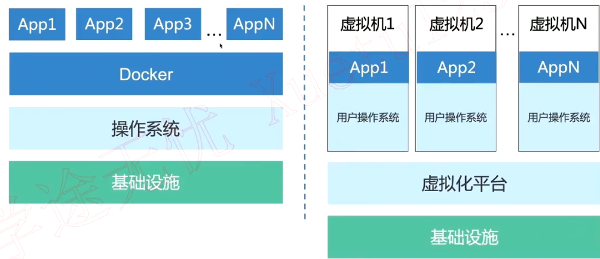

# docker主要特性

+ 文件、资源、网络隔离
+ **变更管理**、日志记录
+ **写时复制**的方式创建的根文件系统

# docker安装演示

环境：

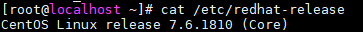

## 删除之前安装过的docker

```shell
sudo yum remove docker \
docker-client \
docker-client-latest \
docker-common \
docker-latest \
docker-latest-logrotate \
docker-logrotate \
docker-engine
```

## 安装依赖

```shell
sudo yum install -y yum-utils \
device-mapper-persistent-data \
lvm2
```

## 添加stable的Docker-ce源

```shell
sudo yum-config-manager \
    --add-repo \
    https://download.docker.com/linux/centos/docker-ce.repo
```

## 安装docker

```shell
sudo yum install docker-ce docker-ce-cli containerd.io
```

## 测试安装

使用 `systemctl start docker` 运行起docker来

```shell
systemctl start docker
```

查看docker进程

```shell
systemctl status docker
```

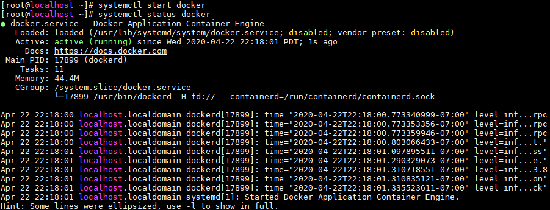

## 第一个docker应用 - hello-world

```shell
docker run hello-world
```

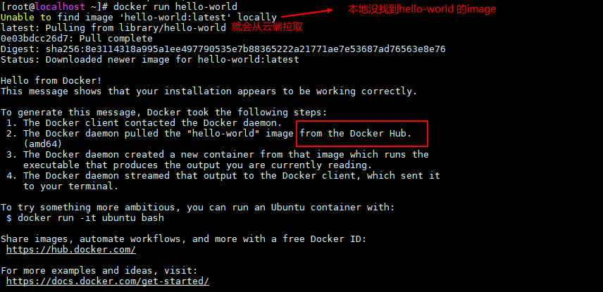

## 使用docker中国官方镜像加速

编辑 `/etc/docker/daemon.json` ，没有就创建改文件

添加以下内容

```json
{
   "registry-mirrors" : ["https://docker.mirrors.ustc.edu.cn"]
}
```

然后重启 daemon和docker进程

```shell
systemctl daemon-reload

systemctl restart docker
```

*附： ubuntu上可以使用 `service docker restart`* 重启docker镜像

## docker 常用命令

+ `docker ps` 查看正在运行的容器

+ `docker ps -a` 查看所有容器

+ `docker stop <id/name>` 停止容器

+ `docker rm <id/name>` 删除一个已经停止的容器

  *注：正在运行的容器是无法删除的*

+ `docker logs -f <id/name>`  打印log -f表示持续打印

+ `docker exec [OPTIONS] CONTAINER COMMAND [ARG...]` 在运行的容器中执行命令

  - **-d :**分离模式: 在后台运行
  - **-i :**即使没有附加也保持STDIN 打开
  - **-t :**分配一个伪终端

  *附：进入docker容器 `docker exec -i -t  <id/name>/bin/bash`*

## 安装mysql的docker容器

进入 [Docker Hub](https://hub.docker.com/)， 找到mysql容器的安装方式

```shell
docker run --name some-mysql -e MYSQL_ROOT_PASSWORD=my-secret-pw -d mysql:tag
```

替换一些参数，自定义一下容器名和密码，这里缺省了 `:tag` ，就会默认拉取最新的镜像，也可以将`tag` 设置为想要拉取的版本，参数 `-d` 意思是后台运行

```shell
docker run --name zy-mysql -e MYSQL_ROOT_PASSWORD=123456 -d mysql
```

然后可以使用 docker ps 查看下载好的镜像了

### 映射mysql服务的端口号 `-p`

```shell
docker run --name zy-mysql -e MYSQL_ROOT_PASSWORD=123456 -p 23457:3306 -d mysql
```

可以看到 `-p `参数后跟着的 `23457:3306` ，前面的数字代表 外部（宿主机）端口，后面的数字代表docker内部的端口

## 进入容器看一眼

```shell
docker exec -it zy-mysql /bin/bash
```

## 退出docker容器

```shell
exit
```

# docker-compose

一个场景：当我们有多个docker容器需要统一管理的时候，难道要一个个的run、stop吗？

显然这样操作太繁琐。

这时就需要一个集成工具，来帮我们统一管理多个docker镜像，查看、启动、停止等。

使用一个 `.yml` 文件来统一管理。

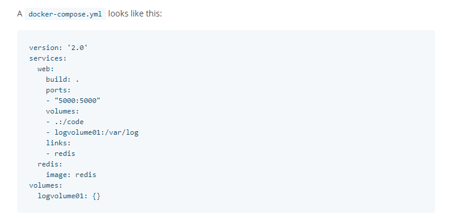

## 安装docker-compose

参考[官方文档](https://docs.docker.com/compose/install/)

```shell
# 下载
sudo curl -L "https://github.com/docker/compose/releases/download/1.25.5/docker-compose-$(uname -s)-$(uname -m)" -o /usr/local/bin/docker-compose
# 给予执行权限
sudo chmod +x /usr/local/bin/docker-compose
# 测试
docker-compose --version
```

> 附：安装后执行docker-compose提示 [Cannot open self /usr/local/bin/docker-compose or archive /usr/local/bin/docker-compoe.pkg解决办法](https://blog.csdn.net/alen_xiaoxin/article/details/104849962)

## 编辑 docker-compose.yml 文件

这里演示启动两个 mysql服务，`mysql1` 和 `mysql2`

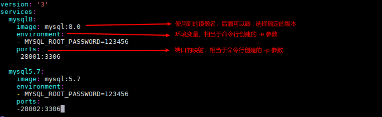

*附： 上图有语法错误，line8、15 的 `-` 后面应有一个空格*

## 批量启动镜像 

然后就可以使用 `docker-compose up -d` 根据 `.yml`文件配置来创建两个容器了

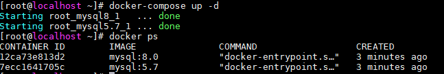

## 停止

使用`docker-compose stop` 批量停止


## 删除

`docker-compose rm`


# 使用[Docker hub](https://hub.docker.com/) 提交、拉取自己的镜像

## 登录

使用 `docker login` 可以登录自己的docker账号，然后就可以提交和拉取了

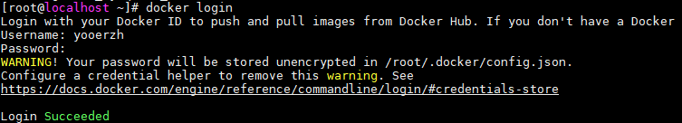

## 创建image

使用 `docker commit 57d92a983a62（容器id） <dockerhub前缀>/<上传的name>[:tag]` 来创建镜像


使用 `docker images` 看一眼自己的镜像

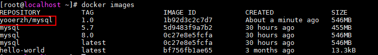

## 推送

`docker push <dockerhub前缀>/<上传的name>[:tag]`

有一些已经存在远端的文件就会 Mounted ，不会再次推送，节约了推送的时间。

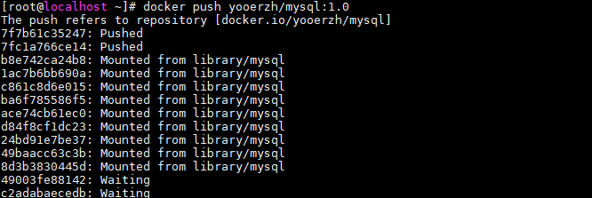

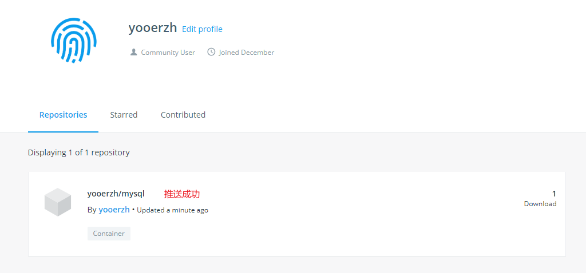

## 拉取

推送成功后可以在随意一台机器上使用 `docker pull <dockerhub前缀>/<上传的name>[:tag]` 拉取镜像了

