# SSH key

生成命令：

`ssh-keygen -t rsa -C "your_email@example.com"`

# 场景一：空仓库&创建仓库提交代码

新建一个文件夹，执行 `git init`命令初始化一个本地仓库

这时会在文件夹中创建一个 `/.git/` 的文件夹

这个文件夹里面放的全部都是文件的**快照**，这些快照会有多个状态，git就是通过管理这些快照来对代码、文件进行版本管理的。

下面可以通过 `git add exampleFile`  命令添加文件到git的管理仓库里了

使用 `git status` 查看文件**缓存**的状态，有没有文件放在了待提交的区域

注： git有两种操作： `add` 、 `commit`  只有commit操作后才会拍一个快照，这个**快照就是一次提交**

`git commit -m "first commit" `  ， commit命令就把文件从缓存区提交到了本地仓库中，也就是一次快照。

这时再使用 `git status` 查看状态就会显示

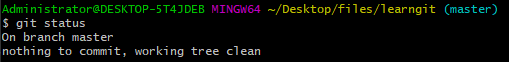

此时如果使用 `git push origin master` ，会提示 不存在

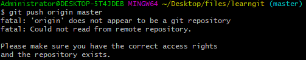

因为origin（初始）是自己创建出来的，要使用`git remote`创建，来告诉git需要推送到哪个远程仓库上去

`git remote add origin git@github.com:xx/learngit-1.git`

 *附： `git clone` 命令会自动设置好 origin*

使用 `git remote add origin git@xx.com:xxx.git`，就可以push到远程仓库了

# 场景二： 推送代码到多个仓库

可以使用 `git remote -v` 查看是否已经有远程仓库的地址

创景概述：

同一个本地git仓库，可以分别给不同的远程仓库提交，就需要设置不同的`origin`来做远程仓库的区分

新建一个空的远程仓库

并在本地git仓库中执行 `git remote add origin2 git@github.com:xxx/learngit-2.git`

注意这里不再是 `origin` 而是设置为了 `origin2` 

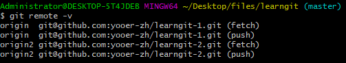

*附：这里不同的远程仓库可以设置到同一个origin里面，这种适用于 一次推送想推送到多个仓库里面去，使用的是git remot里面的 set url指令来设置的。*

*但是不推荐这样做，因为一个仓库通常对应的是一个生产或发布的环境，那么就需要把一部分代码推送到正式的仓库中，也有一部分推送到自己或其他人的仓库。*

然后就可以自己决定代码推送到哪一个远程仓库了

`git push origin2 master`

# 快照管理

`git add xx` 命令是再工作区内对文件进行管理操作

本地会有一个 git的版本库

首先在本地 有些文件是没有被git仓库进行管理的，也有一些是已经管理过的（或提交过）

这时一个新文件做了一些新功能，就需要通过 `git add xx`命令添加到 本地版本库中的 临时管理区域(stage)中，这时git就开始监视这个文件了

当做了一次正式的提交操作后 `commit` ，这个文件就会变成一次快照

*注：此时快照保存的是 文件的改变，而不是文件本身，否则git仓库会非常非常大*

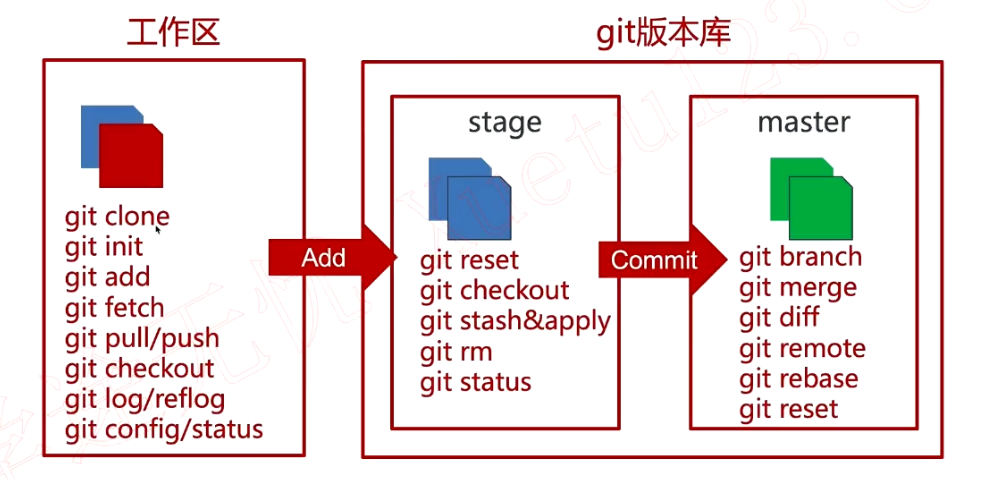

## git log

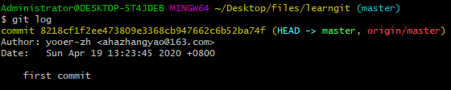

可以看到之前的提交，是谁提交的，什么时候提交的，以及提交的日志，很重要

当需要进行 回滚 的时候，需要查看 hash值

## git reflog

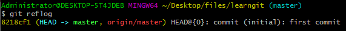

主要是本地的提交，包括一些本地删除的提交，如果要撤回删除的提交，就可以使用 `git reflog`查看 hash值方便回退

## git comfig

配置，查看全局配置 ： `git config --global --list`

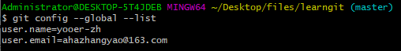

user.name 和 user.email 是必须要设置的，否则不能进行提交操作，如果没有设置，可以使用

`git config --global user.name "example name"`

`git config --global user.email "example@xx.com"`

# git reset

回退，顺便演示 `git log` 和 `git reflog`的区别和使用方法

首先新建 `321.txt`  并再进行一次新的提交

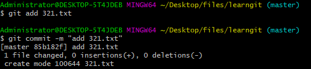

使用 `git log`查看

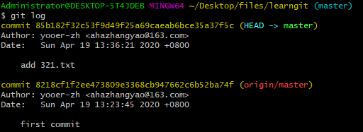

然后使用 `git reset` 命令回退到上一个版本，再使用git log查看时发现新版本就被删除掉了

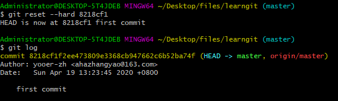

但是使用 `git reflog` 就发现  仍然可以查看本地所有的操作日志

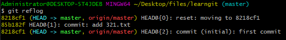

# git branch

创建分支

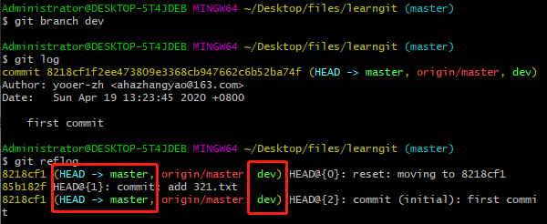

这时仍然可以使用 `git reflog`查看本地所有操作，此时HEAD指向的是 master分支上，后面会多出来一个 dev 分支，这个dev分支前面没有origin，说明此时dev是一个本地分支

# git checkout

此时进行操作 `git checkout dev` 切换到了dev分支

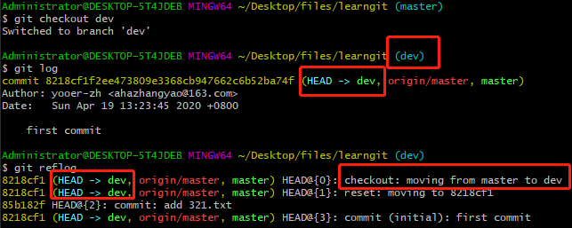

`git log` 只显示了当前指向了dev分支

`git reflog` 则显示了在什么时候切换到的dev分支

# git stash

假如修改一下 `123.txt`，使用 `git status` 就可以看到已经被监控的`123.txt`文件被修改的log

此时123的功能还没有开发完，不想提交到master分支上去

就可以使用 `git stash` 

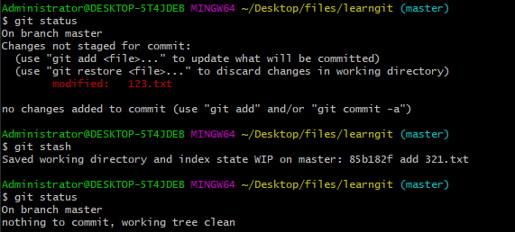

此时再使用 `git status` 就会发现变成了一个clean的工作区，而且此时123.txt文件内的修改会清空

这个文件的修改部分去哪了，怎么找回来？

使用 `git stash apply`

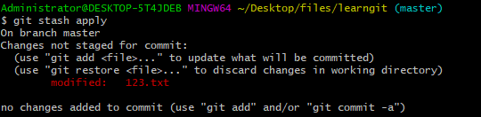

文件就回来了

*适用场景： 在一个分支上开发过程中，需要去别的分支看一眼，但是如果直接切换分支的话会提示有文件被修改，无法切换分支。这时就可以使用 git stash 把当前分支的状态缓存一下，就可以进行分支的切换了。想恢复就使用 git stash apply*

# git diff

想查看当前分支下哪些文件发生了什么变化

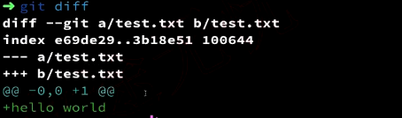

# Git Flow （重点）

开发环境可能会有 自我测试环境、用户测试alpha、beta环境，正式环境

这里不讨论经典模型的问题

## 1. 适用于持续集成的模型

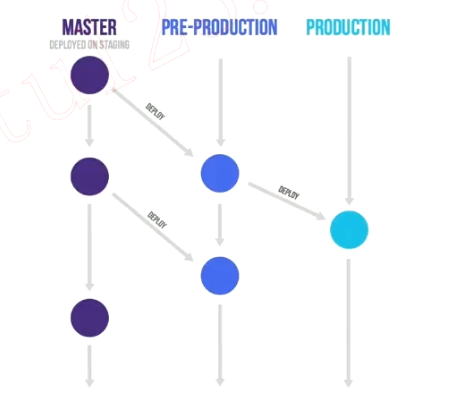

在`master`分支上进行开发提交，一旦到版本需要发布的时候，就把代码合并到 `pre-production`分支上去，这样就算完成了一次测试提交了（预发布）

如果预发布版本没什么问题，就可以合并到 `production` 分支上了，production上的代码就自动进行构建

+ 适用于持续集成多环境场景
+ 上游分支向下游发展

流程：

Bug -> New Branch -> master -> pre branch -> Target Branch

## 2. 类Vue、React的模型

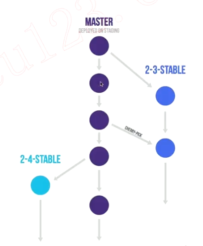

大家都在master分支上开发，当需要对master分支发布一个比较稳定的版本的时候，直接从master分支上新建一个分支出来，然后在这个分支上进行一些小的BUG修复

+ 适用于版本项目
+ 稳定版本从master检出  bug修复在分支

流程： master -> Stable -> new branch -> bug fix ->version

## 演示 Vue的github

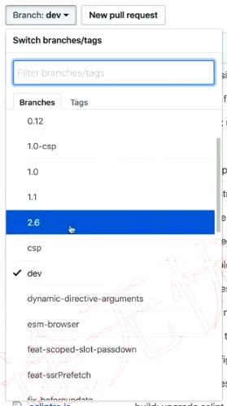

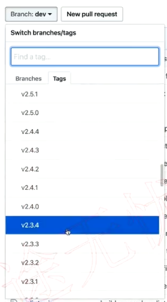

Vue的github上，大家都是在dev分支上玩，然后直接从dev分支checkout版本分支出来

好处： 保证稳定的版本

# 实操 git flow

准备两个本地仓库，remote为同一个远程仓库的origin

拉取远程分支：

`git pull origin master`

假设这两个文件夹是两个不同的人在协同开发

那么两个人就需要商定：

每个人都在自己的 `dev` 分支上玩，`git branch` 查看分支，`git branch dev` 创建分支，就从master分支上检出（复制）了一份代码

因为在现实生活中，多人协作的时候，一般来说除了管理员，一般人是没有master分支的推送权限的，只能拉取

*附： 快速创建并切换分支命令： `git checkout -b dev`*

*注意：如果当前分支上有代码修改的话，是不允许切换到其他分支的。这时就需要经常使用 `git status` 命令查看当前分支的情况*

现在，两个同事在各自的`dev`分支上 同时修改了 `123.txt`， 第一个同事 push 到 dev分支是可以正常推送的

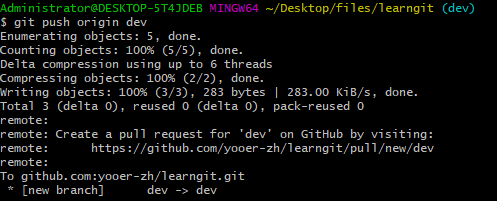

但是当第一位同事推送过后，第二位同事再进行push，就会出现错误

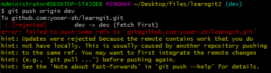

提示说 远程的dev分支上已经有了一个**本地尚不存在**的提交

这时有两种方法

1. 大众做法，根据提示 使用 `git pull`，会自动执行合并

   此时因为两位同事对同一个文件进行了修改，所以肯定会遇到合并冲突

   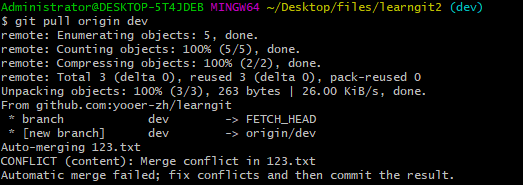

   使用 `git status` 查看一下状态，说双方都修改了 `123.txt`

   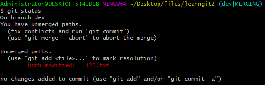

   此时打开 `123.txt`文件，会出现git生成的分隔

   上面的HEAD是本地本分支上的代码，下面就是远程代码的变化

   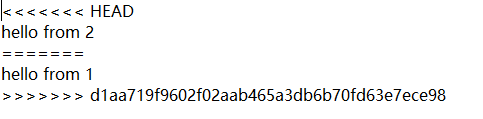

   此时修改好内容，保留本地的修改，然后执行 `git add 123.txt` `git commit`

   ！ 此时再使用 `git status` 查看时发现当前是一个干净的分支

   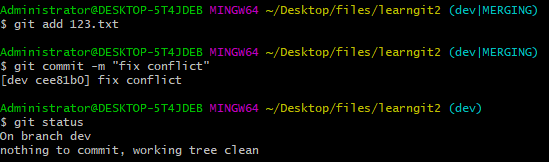

   这时再push dev 就可以了

   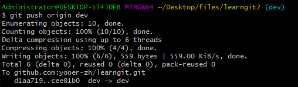

2. 先进的解决办法 `git fetch`

   ！ `git pull `命令相当于是 `git fetch` + `git merge`

   `git fetch`命令只会拉取远程更新，但是不会把远程的更新合并到本地分支里面去。

   简单说就是看一下远端分支和我本地分支有什么不一样

   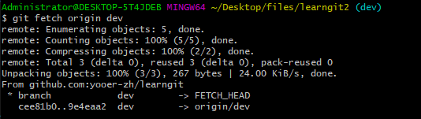

   会提示远程有一个更新，现在已经把更新的内容放到了`FETCH_HEAD`中

   `git merge FETCH_HEAD` 就相当于合并两边的代码，就和直接使用 `git pull` 命令效果一样了。

   如果 使用`git fetch origin feature:dev1` ，意思是把远端的feature分支合并到本地的 dev1分支上，如果dev1不存在，则会自动创建，并且此时 dev1分支上的代码就是 远端feature分支的代码了

   此时再切换到 `dev` 分支上  使用 `git merge dev1` 就可以把代码合并到dev分支上来了

   但是如果感觉远端的代码不好，又不想`merge`了怎么办？

   使用 `git reset --hard head^` 回退到上一次提交的快照

